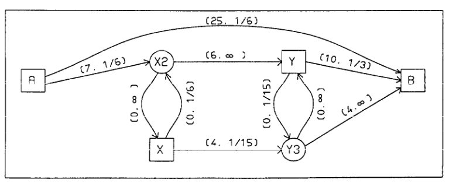
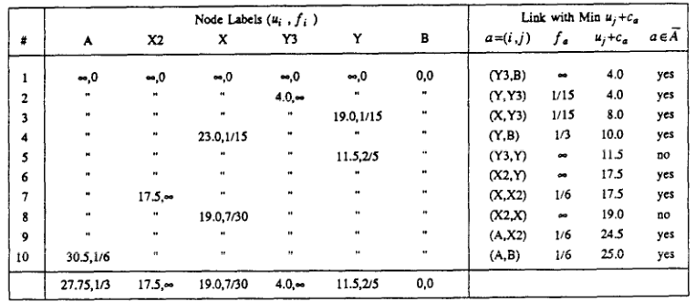
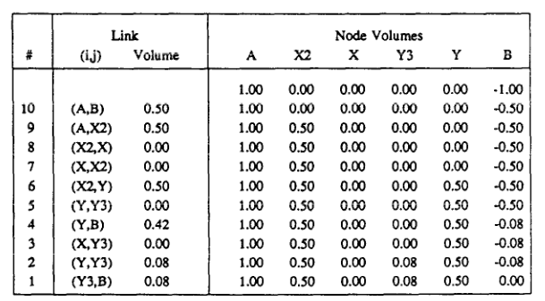

# An example following paper

Paper: [Spiess, H. and Florian, M. (1989) "Optimal strategies: A new assignment model for transit networks"](https://doi.org/10.1016/0191-2615(89)90034-9)

* From the root directory of this repository:
    ```shell
    go run ./examples/paper/main.go
    ```

* How transit network looks like according to the paper:
<p align="center">

<p align="center">Fig 1. Transit network with link cost and frequencies</p>
</p>

So headways are:
* headway of A-B = 6 minutes
* A-X2 = 6
* X-X2 = 6
* Y3-Y = 15
* X-Y3 = 15
* Y-Y3 = 15
* Y-B = 3

Others headways are equal to zero, therefore frequencies are $+\inf$

Costs:
* travel cost of A-B = 25 minutes
* A-X2 = 7
* X2-Y = 6
* X-Y3 = 4
* Y3-B = 4
* Y-B = 10

Others travel costs considered to be equal to zero. But in real life cases transfers (maybe even boarding and alighting links) have positive travel costs.

```go
allNodes := map[string]struct{}{
    "A": {},
    "X": {}, "X2": {},
    "Y": {}, "Y3": {},
    "B": {},
}
allLinks := []*hyperpaths.Link{
    {"A", "B", "Line 1", 25, 6},
    {"A", "X2", "Line 2", 7, 6},
    {"X2", "X", "Line 2", 0, 0},
    {"X", "X2", "Line 2", 0, 6},
    {"X2", "Y", "Line 2", 6, 0},
    {"Y3", "Y", "Line 3", 0, 15},
    {"Y", "B", "Line 4", 10, 3},
    {"X", "Y3", "Line 3", 4, 15},
    {"Y", "Y3", "Line 3", 0, 15},
    {"Y3", "B", "Line 3", 4, 0},
}
```

* Finding optimal strategy
We should find optimal strategy to reach destination node `B`. According to the paper we should got:
<p align="center">

<p align="center">Fig 2. ind optimal strategy for example network</p>
</p>

```shell
Optimal strategy:
        Node labels:
                u_{i} = B: 0.000000
                u_{i} = A: 27.750000
                u_{i} = X: 19.071426
                u_{i} = X2: 17.500000
                u_{i} = Y: 11.500001
                u_{i} = Y3: 4.000000
        Nodes probablities:
                f_{i} = Y3: 99999997952.000000
                f_{i} = B: 0.000000
                f_{i} = A: 0.333333
                f_{i} = X: 0.233333
                f_{i} = X2: 99999997952.000000
                f_{i} = Y: 0.400000
        Attractive links set:
                 a = (i, j) = (A, B)
                 a = (i, j) = (A, X2)
                 a = (i, j) = (X2, Y)
                 a = (i, j) = (X, X2)
                 a = (i, j) = (Y, B)
                 a = (i, j) = (X, Y3)
                 a = (i, j) = (Y, Y3)
                 a = (i, j) = (Y3, B)
```

* Assiging demand
Considering only one trip from node `A` to destination node `B`, we should got:
<p align="center">

<p align="center">Fig 3. Assign demand on example network</p>
</p>

```shell
Volumes:
        Links volumes:
                v_{i, j} = (X2, X): 0.000000
                v_{i, j} = (X2, Y): 0.500000
                v_{i, j} = (X, X2): 0.000000
                v_{i, j} = (X, Y3): 0.000000
                v_{i, j} = (Y3, Y): 0.000000
                v_{i, j} = (Y3, B): 0.083333
                v_{i, j} = (Y, B): 0.416667
                v_{i, j} = (Y, Y3): 0.083333
                v_{i, j} = (A, B): 0.500000
                v_{i, j} = (A, X2): 0.500000
        Nodes volumes:
                v_{i} = X2: 0.500000
                v_{i} = Y: 0.500000
                v_{i} = Y3: 0.083333
                v_{i} = B: 0.000000
                v_{i} = A: 1.000000
                v_{i} = X: 0.000000
```